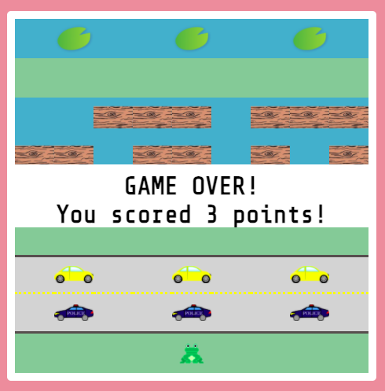
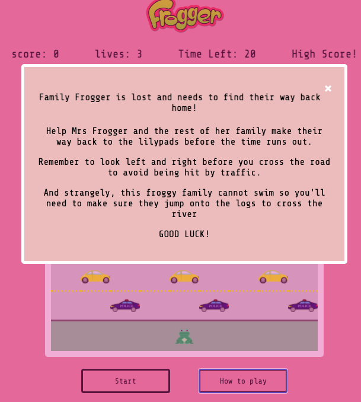
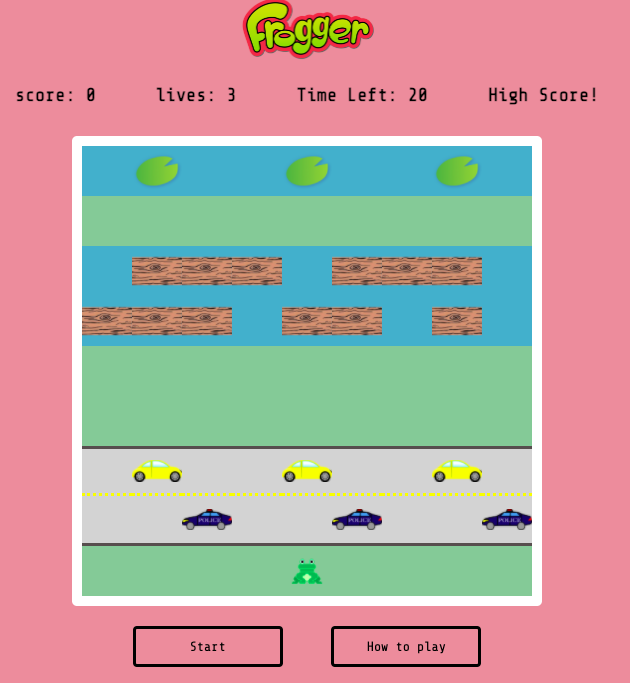

###  General Assembly, Software Engineering Immersive

# Frogger 

### Overview

Frogger. My first front-end developement project to be completed on the General Assembly's Software Engineering Immersive Course. 

We were challenged over the course of a week to re-create a classic grid game. The game was to be completed individually in one week, rendered in the browser and created using vanilla JavaScript, CSS and HTML.  

Check it out here -> [FROGGER] ( [https://rachel-beale.github.io/project-1/](https://rachel-beale.github.io/project-1/) )

### Brief

- Render a game in the browser
- Create a game using vanilla Javascript, HTML & CSS
- Design logic 
- Deploy the game online

## Approach Taken 

#### The Grid:

The first step for this project was to create the grid. I decided to use a `for loop` to create the grid dynamically rather than hardcode divs into my HTML. This will allow me to easily change the scale of the game in the future. 

```javascript
for (let i = 0; i < width ** 2; i++) {
  const div = document.createElement('div')
  div.classList.add('cell')
  grid.appendChild(div)
  cells.push(div)
}
```


#### Moving Parts

##### The frog

The frog should only move after the player has pressed the start button. To prevent movement before the start button had been pressed, I created a boolen variable called `gameRunning` which is initially set to false. 

Inside the  keydown event listener, I have stated that if  `!gameRunning` , return - which means the player cannot move the frog. As soon as the start button is pressed, `gameRunning` is changed to true, which will allow the player to move the frog using the arrow buttons.

```javascript
document.addEventListener('keydown', (event) => {
  if (!gameRunning) {
    return
  } else {
    const key = event.key
    if (key === 'ArrowUp' && !(frog < width)) {
      frog -= width
    } else if (key === 'ArrowDown' && !(frog > (width ** 2) - width - 1)) {
      frog += width
    } else if (key === 'ArrowLeft' && !(frog % width === 0)) {
      frog -= 1
    } else if (key === 'ArrowRight' && !(frog % width === width - 1)) {
      frog += 1
      cells[frog].classList.add('frog')
    }
  }
  renderGame()
  gameOver()
})
```


#### The cars and logs

The cars and logs are all automated in this game. This is done using functions with set interval which creates the movement. Below is an example of one of these functions: 

```javascript
function carRight() {
  yellowCarInterval = setInterval(() => {
    yellowCar.forEach((carRightMove, i) => {
      if (carRightMove === 62) {
        yellowCar[i] -= 8
      } else {
        yellowCar[i] += 1
      }
    })
    renderGame()
  }, 800)
}
```

All of the automated movement functions are called within the start button click event listener, so they can only move once the game has started. 

#### Frog on the log

One of the key conponents of this game was getting the frog to cross the river on a log. I used the below logic to check that the frog was on the log, and if she was, a set interval is used to allow the frog to move at the same time as the log. 

```javascript
function frogLogMove() {
  frogOnLog = setInterval(() => {
    if (frog >= 27 && frog < 36 && cells[frog].classList.contains('log')) {
      frog -= 1
    } else if (frog >= 18 && frog < 26 && cells[frog].classList.contains('log')) {
      frog += 1
    }
    renderGame()
  }, 999.5)
}
```


#### Crash detection  

In this game, you can loss a life in two ways: 

- If the frog is hit by a car
- If the frog touches the water while not being on a log or lilypad.

If the frog has contact with one of these obstacles, a life is deducted and the frog is reset to the starting position. 

```javascript
function frogCrashDetection() {
  const frogCarCrash = setInterval(() => {
    if (cells[frog].classList.contains('policeCar')
      || cells[frog].classList.contains('yellowCar')
      || cells[frog].classList.contains('water') && !cells[frog].classList.contains('log') && !cells[frog].classList.contains('lilypad')) {
      const newLives = lives -= 1
      livesLeft.innerHTML = newLives
      clearInterval(frogCarCrash)
      resetFrog()
    }
  }, 300)
}
```


#### Game Over

The game ends when the timer reaches zero, or there are no further lives left. When this happens, a `gameOver()` function is  called which resets everything on the board to it's original starting state: 

- The timer
- Lives counter
- Cars and logs movement - clearing all intervals and removing all event listeners
- Changed the gameRunning boolean back to False
- Resets the frog

It also calls a `gameDisplay()` function which briefly displays a game over message and the points the player had scored in that round. 




#### Render Game

I managed to complete the MVP of Frogger with some time to spare. So I decided to refactor some of my code with this render game function:

```javascript
function renderGame() {
  cells.forEach(cell => {
    cell.classList.remove('frog')
    cell.classList.remove('yellowCar')
  })
  cells[frog].classList.add('frog')
  yellowCar.forEach(yellowCarTile => {
    cells[yellowCarTile].classList.add('yellowCar')
  })
  policeCar.forEach(policeCarTile => {
    cells[policeCarTile].classList.add('policeCar')
  })
  logsRight.forEach(logTile => {
    cells[logTile].classList.add('log')
  })
  logsLeft.forEach(logTile => {
    cells[logTile].classList.add('log')
  })
  lilypads.forEach(lilypadTile => {
    cells[lilypadTile].classList.add('lilypad')
  })
```

This function works by stripping the board of all the elements before placing them back depending on the logic.  This function was great in cutting down the repetitive sections which I had previously had to hard code in. 

### Challenges

- It was tricky getting the game to completely reset when the time or lives got to zero. Especially removing the event listeners and stopping the frog from moving. I eventually realised a boolean would resolve the issue, this is the `gameRunning` variable which I described above. 
- It took a while to get the automated movement of the cars and logs working. Due to multiple `setIntervals` and `forEach` methods used. 

### Future Improvements

- More of the code can be refactored - especially the car and log movement functions. 
- Create multiple difficulty levels, with a different map for the frog to travel across and more obstacles. 
- Ability to get bonus points - by collecting special food or items on the way to the lilypads. 
- To make the game mobile responsive. 






